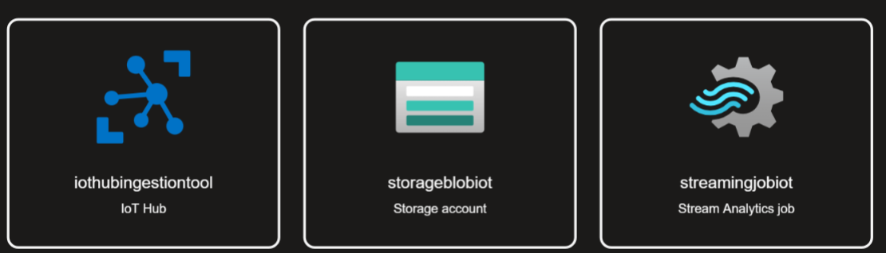
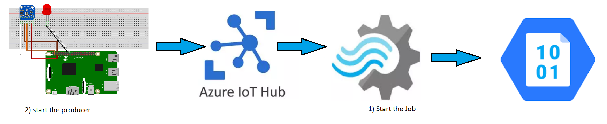

# Creation environnement virtuel & lancement de kafka-ui

Below all the steps:

1. Set KAFKA_ADVERTISED_HOST_NAME: IP VM DST in `docker-compose.yaml`
2. Open a terminal and execute the lines below : (when executing the first time)

```sh
# create a folder (e.g mc_streaming) and enter in it
cd mc_streaming/

# Create a virtual environement
virtualenv mc_streaming

# Activate the venv
source mc_streaming/bin/activate

# install the librairies
pip install -r requirements.txt

# launch the docker compose
docker-compose up -d

# Check the container (you should see only 1)
docker ps

# Peut prendre un peu de temps
# go to <VM-ip-adress>:8080
# e.g 54.155.132.78:8080

# increase the numbers of bokers (scale the kafka cluster)
docker-compose up --scale kafka=3 -d

# Chech the number of containers
docker ps

# crete the mc_streaming/data/ folder
mkdir data
# upload consumer.py and producer.py or go to the next step

# Create producer and consumer
touch producer.py consumer.py

```

# Producer launch

The producer will launch kafka and send messages in a particular topic

```bash
# complete and run producer.py
# make sur you change the IP_ADDRESS of your VM
python producer.py
```

We can see the launch of the loading bar in the terminal (thanks tqdm) and on kafka-ui we can see the topic `Twitter` with the messages starting to appear (this operation may require a refresh of kafka-ui).

# Consumer launch

The purpose of the consumer is to retrieve the data and apply particular treatments.

I need to get back into my virtual environment first:

```sh
# go back to mc_streaming and activate the venv
cd mc_streaming/
source mc_streaming/bin/activate

# Run the producer
python consumer.py
```

Hopefully, we can see the sentiment_score.txt file and finally display the score value on a dashboard.

# Display the score on a DASH dashboard

To start the producer and maunch the dash:

```python
# run the producer
python producer.py

# display the value on the dashboard (in another terminal)
python dashboard.py
```

# But wait a minute...

Why the need to store results on the disk and read the latter to display on DASH? Why not process the data on the fly at the same time that we store results in files?

In practice we will use a data processing tool to take action while storing the results at the same time. We will do it in the cloud with Azure with the following components:

* Producer : [Raspberry Pi Azure IoT Web Simulator (azure-samples.github.io)](https://azure-samples.github.io/raspberry-pi-web-simulator/)
* Data ingestion tool: IoT hub
* Data processing tool: Stream analytics
* Consumer: Blob Storage



The process is as it follows:



In addition, we will use a sensor data simulator to act as a producer (Make sur you change the connection string of the IoT Hub device): [Raspberry Pi Azure IoT Web Simulator (azure-samples.github.io)](https://azure-samples.github.io/raspberry-pi-web-simulator/)

The query to use in stream analytics:

```sql
-- processing = select the temperature above 18°
SELECT
    *
INTO
    [streamoutputblob]
FROM
    [streaminputiothub]
WHERE
    Temperature > 18
```

Hope you enjoyed!!
